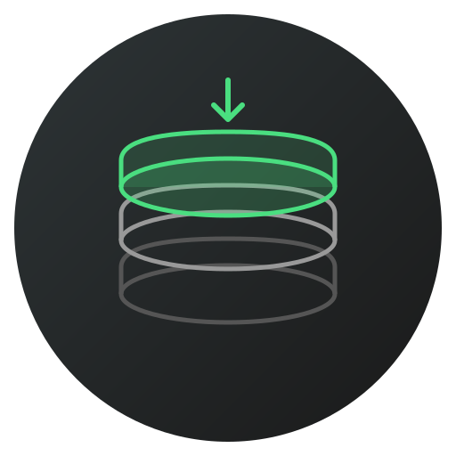

# nodeman

<p align="center">
  
</p>

A fast, cross-platform Node.js version manager written in Go.

## Features

- **Install & manage** multiple Node.js versions from nodejs.org
- **Switch versions** instantly with shim-based forwarding (no shell hooks needed)
- **Automatic global package shims** — `npm install -g` packages are immediately available on PATH
- **Tracked global packages** — reinstall a set of packages automatically when switching versions
- **Clean up old installations** — detect and remove Node.js from Homebrew, nvm, fnm, Volta, etc.
- **Cross-platform** — macOS (arm64/amd64), Linux (arm64/amd64), Windows (amd64)
- **Single binary** — no runtime dependencies
- **Automatic setup** — configures PATH and shell completions for you
- **Proxy support** — respects `HTTP_PROXY`, `HTTPS_PROXY`, `NO_PROXY`
- **Version file support** — reads `.nvmrc` and `.node-version` files
- **Self-upgrade** — update nodeman with a single command

## Quick Start

```bash
# Download the latest release for your platform from:
# https://github.com/RoenLie/nodeman/releases

# Make it executable (macOS/Linux)
chmod +x nodeman

# Run setup — installs shims, configures PATH, and sets up shell completions
./nodeman setup

# Restart your terminal, then:

# Install the latest LTS Node.js
nodeman install lts

# Set it as active
nodeman use lts

# Verify
node --version
```

### Building from Source

```bash
git clone https://github.com/RoenLie/nodeman.git
cd nodeman
make setup    # Builds, installs shims, and configures PATH
```

## Commands

| Command | Description |
|---|---|
| `nodeman install <version>` | Download and install a Node.js version |
| `nodeman uninstall <version>` | Remove an installed version |
| `nodeman use [version]` | Set the active version (installs if needed) |
| `nodeman use --previous` | Switch back to the previously active version |
| `nodeman ls` | List installed versions |
| `nodeman ls-remote` | List latest version per major release (18+) |
| `nodeman ls-remote --full` | List all available versions |
| `nodeman ls-remote <major>` | List all versions for a specific major (e.g. `22`) |
| `nodeman ls-remote --lts` | List only LTS versions |
| `nodeman ls-remote --no-cache` | Bypass the 1-hour version cache |
| `nodeman current` | Show the active version |
| `nodeman setup` | Create shims, configure PATH and completions, detect existing Node |
| `nodeman adopt` | Import existing system Node.js into nodeman |
| `nodeman clean` | Detect and remove external Node.js installations |
| `nodeman doctor` | Diagnose configuration issues |
| `nodeman upgrade` | Upgrade nodeman to the latest release |
| `nodeman self-uninstall` | Remove nodeman and all its data from your system |
| `nodeman dir` | Print the nodeman root directory path |
| `nodeman dir shims` | Print the shims directory path |
| `nodeman dir versions` | Print the versions directory path |
| `nodeman dir active` | Print the active version's directory path |
| `nodeman shims sync` | Manually sync shims for globally installed packages |
| `nodeman globals list` | List tracked global packages |
| `nodeman globals add <pkg>` | Track a global package |
| `nodeman globals remove <pkg>` | Untrack a global package |
| `nodeman completion <shell>` | Generate shell completions (bash/zsh/fish/powershell) |

## Version Specifiers

All commands that take a `<version>` argument accept flexible specifiers:

```bash
nodeman install 22          # Latest 22.x.x
nodeman install 22.14       # Latest 22.14.x
nodeman install 22.14.0     # Exact version
nodeman install lts          # Latest LTS release
nodeman install latest       # Latest overall release
```

## Version Files (.nvmrc / .node-version)

If you run `nodeman use` without a version argument, it searches for a `.nvmrc`
or `.node-version` file in the current directory and parent directories:

```bash
# Create a version file
echo "22" > .nvmrc

# nodeman reads it automatically
nodeman use
# Found /path/to/.nvmrc: 22
# Now using Node.js 22.14.0
```

## Environment Override

Set `NODEMAN_VERSION` to temporarily override the active version without
changing `config.json`:

```bash
NODEMAN_VERSION=20 node --version   # Uses latest installed 20.x
NODEMAN_VERSION=22.14.0 npm test    # Uses exact version
```

## Adopting Existing Installations

If you already have Node.js installed (via Homebrew, nvm, official installer, etc.),
nodeman can detect and import it:

```bash
# Scan and interactively adopt detected installations
nodeman adopt

# Adopt a specific version directly
nodeman adopt 22

# Adopt and immediately set as active
nodeman adopt --set-active 22
```

`nodeman setup` will also automatically detect existing installations and remind
you to adopt them. After adopting, you can remove the original with `nodeman clean`.

## Cleaning Up Old Installations

Once you've migrated to nodeman, remove leftover Node.js installations:

```bash
nodeman clean
```

This scans for Node.js installed via Homebrew, nvm, fnm, Volta, Snap, the
official installer, and other common sources. For each one found, it shows
the removal action and asks for confirmation.

```bash
# Skip confirmation prompts
nodeman clean --yes
```

Supported removal methods:
- **Homebrew** — runs `brew uninstall node`
- **nvm / fnm / Volta** — removes their Node.js version directories
- **Snap** — runs `snap remove node`
- **Official installer** — removes files from `/usr/local` (macOS) or runs the MSI uninstaller (Windows)

## Global Packages

### Automatic Shim Sync

When you install a package globally with `npm install -g`, nodeman automatically
creates a shim for it so the command is available on PATH immediately — no
restart or manual step needed.

```bash
npm install -g pnpm
pnpm --version    # Works immediately
```

If you need to manually refresh shims (e.g. after installing packages outside
of npm), run:

```bash
nodeman shims sync
```

### Tracked Globals

Track packages you want available across all Node.js versions:

```bash
nodeman globals add typescript eslint prettier
```

When you switch versions with `nodeman use`, all tracked packages are
automatically reinstalled with the new version's npm.

## Browsing Remote Versions

By default, `ls-remote` shows the latest version in each major release line
(18 and above), keeping the output concise:

```bash
nodeman ls-remote
# v18.20.8  (LTS: Hydrogen)
# v20.19.2  (LTS: Iron)
# v22.16.0  (LTS: Jod)
# v24.14.0
```

To see every available version:

```bash
nodeman ls-remote --full
```

To see all versions for a specific major:

```bash
nodeman ls-remote 22
```

## Directory Paths

Print paths to nodeman's directories for use in scripts:

```bash
nodeman dir              # ~/.nodeman
nodeman dir shims        # ~/.nodeman/shims
nodeman dir versions     # ~/.nodeman/versions
nodeman dir active       # ~/.nodeman/versions/<active version>
```

## Diagnostics

Run `nodeman doctor` to verify your setup:

```bash
nodeman doctor
# ✓ Data directory: /home/user/.nodeman
# ✓ Active version: 22.14.0
# ✓ 3 version(s) installed
# ✓ Shims directory exists
# ✓ Core shims: node, npm, npx, corepack
# ✓ PATH priority: shims come first
# ✓ which node → ~/.nodeman/shims/node
# ✓ which npm → ~/.nodeman/shims/npm
# ✓ node v22.14.0
# ✓ npm 10.9.2
# ✓ No conflicting installations
# ✓ Completions: configured
```

## Proxy Support

nodeman respects standard proxy environment variables:

```bash
export HTTP_PROXY=http://proxy.example.com:8080
export HTTPS_PROXY=http://proxy.example.com:8080
export NO_PROXY=localhost,127.0.0.1
```

All downloads (Node.js binaries, version index, checksums, self-upgrade) will
route through the configured proxy.

## Caching

Remote version listings are cached for 1 hour in `~/.nodeman/cache/`. Use
`--no-cache` with `ls-remote` to force a fresh fetch:

```bash
nodeman ls-remote --no-cache
```

## Self-Upgrade

```bash
nodeman upgrade
```

Downloads the latest release from GitHub and replaces the current binary.

## Uninstalling

To completely remove nodeman from your system:

```bash
nodeman self-uninstall
```

This removes the `~/.nodeman` directory (shims, installed Node.js versions,
config), cleans PATH entries from your shell profile, and removes completion
configuration. Use `--yes` to skip the confirmation prompt.

## Shell Completions

`nodeman setup` automatically configures tab completions for your shell.
If you need to set them up manually:

**Bash:**
```bash
echo 'eval "$(nodeman completion bash)"' >> ~/.bashrc
```

**Zsh:**
```bash
echo 'eval "$(nodeman completion zsh)"' >> ~/.zshrc
```

**Fish:**
```fish
nodeman completion fish > ~/.config/fish/completions/nodeman.fish
```

**PowerShell:**
```powershell
nodeman completion powershell | Out-String | Invoke-Expression
# To make persistent, add the above to your $PROFILE
```

## How It Works

### Shims

When you run `nodeman setup`, it creates shim binaries in `~/.nodeman/shims/`.
These are hardlinked copies of the `nodeman` binary itself.

When invoked as `node` (or `npm`, `npx`, `pnpm`, etc.), nodeman detects the
invocation name, reads the active version from `~/.nodeman/config.json`, and
replaces itself with the real binary using `exec`.

This means:
- No shell hooks or `eval` needed
- Works with any shell (bash, zsh, fish, PowerShell, cmd)
- Zero overhead once exec'd — the shim is replaced by the real binary
- Any globally installed package gets a shim automatically

## Directory Structure

```
~/.nodeman/
├── config.json        # Active version + previous version
├── globals.json       # Tracked global packages
├── cache/             # Cached remote version index
│   └── remote-versions.json
├── shims/             # Shim binaries (added to PATH)
│   ├── node
│   ├── npm
│   ├── npx
│   ├── corepack
│   ├── pnpm           # Auto-created for global packages
│   └── nodeman
└── versions/          # Installed Node.js versions
    ├── 22.14.0/
    ├── 20.18.3/
    └── ...
```

## Building from Source

```bash
# Clone
git clone https://github.com/RoenLie/nodeman.git
cd nodeman

# Build and install (creates shims + configures PATH)
make setup

# Or just build without installing
make build    # Output in dist/

# Build for all platforms
make all
```

## Cross-Compilation Targets

| OS | Architecture | Binary |
|---|---|---|
| macOS | arm64 | `nodeman-darwin-arm64` |
| macOS | amd64 | `nodeman-darwin-amd64` |
| Linux | arm64 | `nodeman-linux-arm64` |
| Linux | amd64 | `nodeman-linux-amd64` |
| Windows | amd64 | `nodeman-windows-amd64.exe` |

## License

MIT
